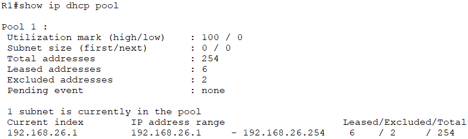
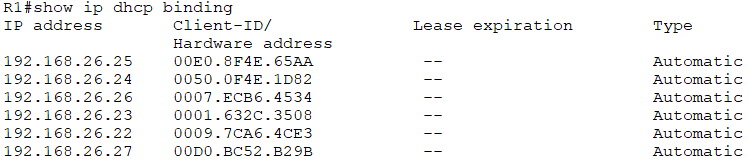
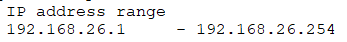
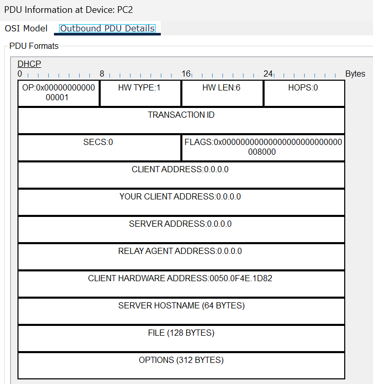
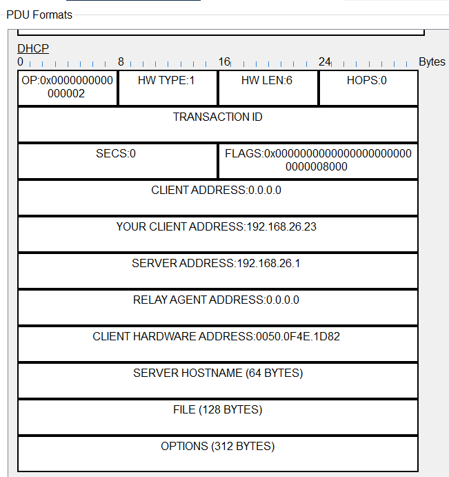

# Laborübung 1 - DHCP mit Cisco Packettracer

 - Datum: 08.12.2023
 - Name: Lukas Grüter
 - [Link zur Aufgabenstellung](https://gitlab.com/alptbz/m123/-/blob/main/05_DHCP/DHCP_PacketTracer/01_DHCP.md?classId=9ba60267-a232-4ef1-8383-77bdea5d9bdf)

---

## Router Konfiguration

 - Für welches Subnetz ist der DHCP Server aktiv? Subnet: 192.168.26.0/24
   - 
 - Welche IP-Adressen ist vergeben und an welche MAC-Adressen? (Antwort als Tabelle)
   - 
 - In welchem Range vergibt der DHCP-Server IPv4 Adressen?
   - 
 - Was hat die Konfiguration ip dhcp excluded-address zur Folge?
   - Damit können bestimmte IP-Adressen in DHCP Range reserviert werden, so dass sie statisch vergeben werden können.
 - Wie viele IPv4-Adressen kann der DHCP-Server dynamisch vergeben?
   - Insgesamt 254 verschiedene Addressen.
   
## DORA - DHCP Lease beobachten

 - Welcher OP-Code hat der DHCP-Offer?
   - Code ist 2.
 - Welcher OP-Code hat der DHCP-Request?
   - Code ist 1.
 - Welcher OP-Code hat der DHCP-Acknowledge?
   - Code ist 5.
 - An welche IP-Adresse wird der DHCP-Discover geschickt? Was ist an dieser IP-Adresse speziell?
   - An die Broadcastadresse: 192.168.26.255. Wenn man diese IP ping, geht die Pakete an alle IPs im Netz.
 - An welche MAC-Adresse wird der DHCP-Discover geschickt? Was ist an dieser MAC-Adresse speziell?
   - FF.FF.FF.FF.FF.FF; Dies ist die Broadcast MAC, da sie an alle Geräte im lokalen Netz gesendet wird.
 - Weshalb wird der DHCP-Discover vom Switch auch an PC3 geschickt?
   - PC2 weiss noch nicht, welches Gerät ihm Netzwerk ihm via DHCP automatische eine IP vergeben kann, deswegen fragt er bei allen Geräten die Verfügbarkeit dieses Dienstes ab und so wird auch PC3 angefragt.
 - Gibt es ein DHCP-Relay in diesem Netzwerk? Wenn ja, welches Gerät ist es? Wenn nein, wie kann das mithilfe der DHCP-PDUs festgestellt werden?
   - Ja, das DHCP-Relay ist in diesem Netz der Router. Man kann mittels PDU die zugehörige IP erkennen.
 - Welche IPv4-Adresse wird dem Client zugewiesen?
   - 192.168.26.23/24
 - Screenshots:
 
 
 
 
 
##Netzwerk umkonfigurieren
 
IP für Server: 192.168.26.2/24

**Ausgeführte Schritte:**

 - ```ip dhcp excluded-address 192.168.26.2 192.168.26.2``` wurde ausgeführt in CLI des Routers
 - IP/Subnetz und Gateway wurde beim Server auf die bestimmte IP gesetzt (statisch)
 - Ping von PC 1 an Server 0, welcher erfolgreich war.

[image](Server-FE0.png)
[image](Server-GW0.png)
[image](Server-WEB.png)