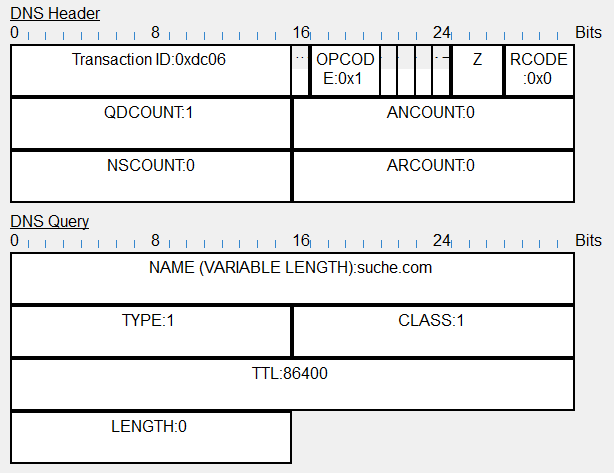
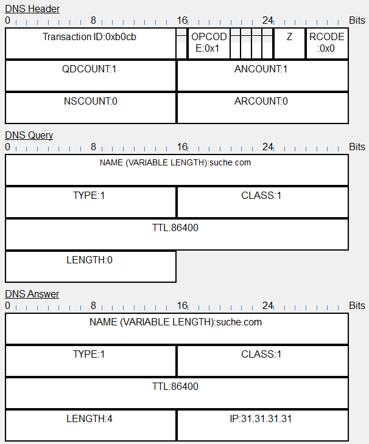

# Laborübung 2 - DNS mit Cisco Packettracer

 - Datum: 08.12.2023
 - Name: Lukas Grüter
 - [Link zur Aufgabenstellung](https://gitlab.com/alptbz/m123/-/blob/main/06_DNS/DNS_PacketTracer/01_DNS.md)

---

## Fragen DNS Query

 - Wie weiss der PC0, dass er den DNS Query an 1.1.1.1 bzw. DNS-Server schicken muss?
	- Der DHCP hat dem Client die IP des DNS zugewiesen. So weiss er auch, wohin er den DNS Query schicken muss.

 - Welches Layer 4 Protokoll kommt bei DHCP zum Einsatz?
	- Es läuft über UDP (User Datagram Protocol).

 - Was für einen QDCOUNT Wert hat es und in welchem Teil ist diese Feld?
	- Der QDCOUNT ist 1, man findet ihn beim DNS Header.

 - Wie lautet die Transaction ID?
	- Die Transaction ID ist 0xdc06.

 - Was für einen TYPE und CLASS hat der Query?
	- Type: 1 Class: 1

## Fragen DNS Response

 - Was für eine IP Adresse steht in der DNS query response bzw. DNS Answer? ==> Mit Screenshot belegen.
	- Es ist die IP des Web-Servers: 31.31.31.31

 - Inwiefern unterscheidet sich die DNS query response zur DNS query? In welchem/n Feld(ern) sind der "DNS-Packet-Typ" festgehalten?
	- Die Transaction ID unterscheidet sich bei beiden Paketen. Der ANCOUNT ist bei der Antwort auf 1, bei der Anfrage auf 0. Das DNS Packet wird in "TYPE" und "CLASS" eingeteilt und kann so identifiziert werden.