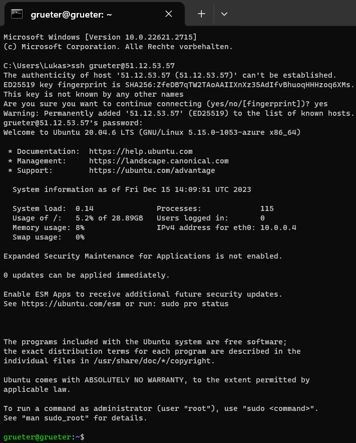
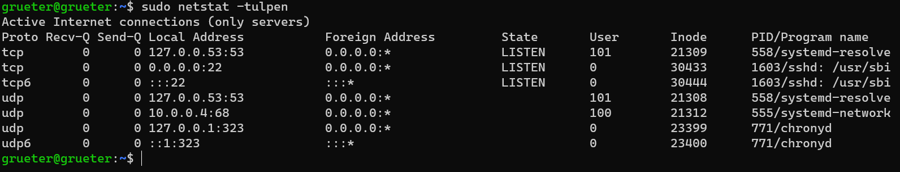
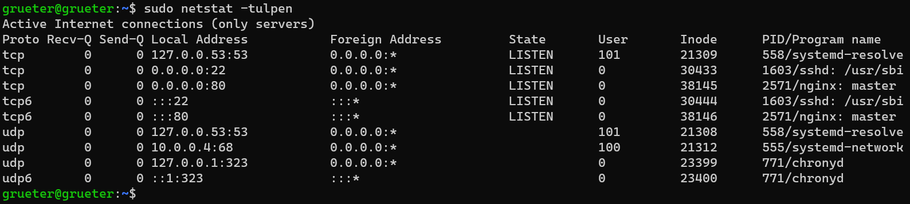
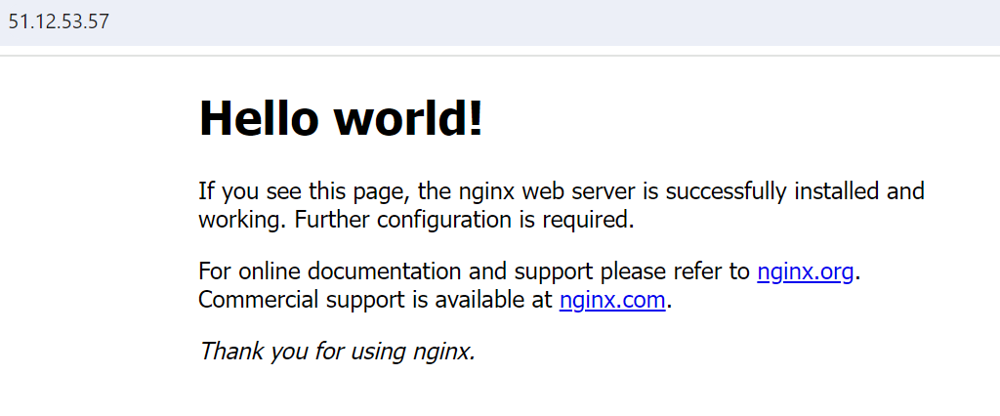
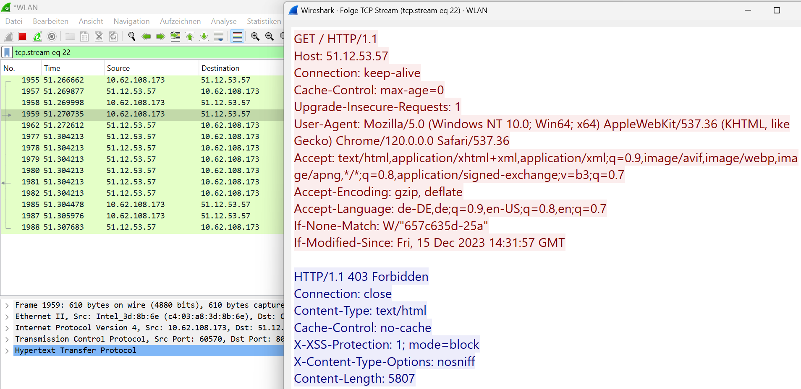
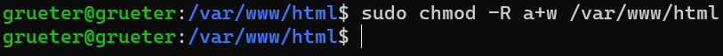
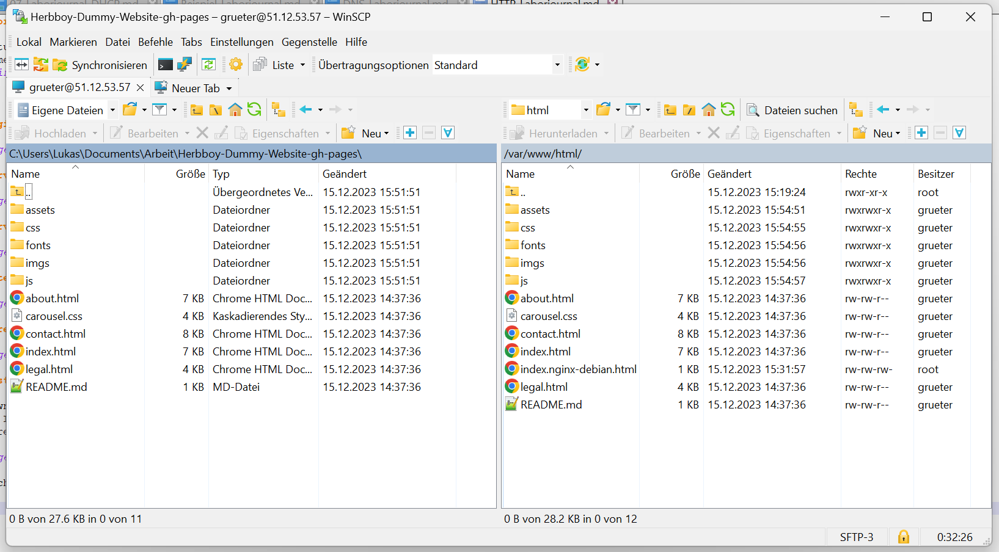
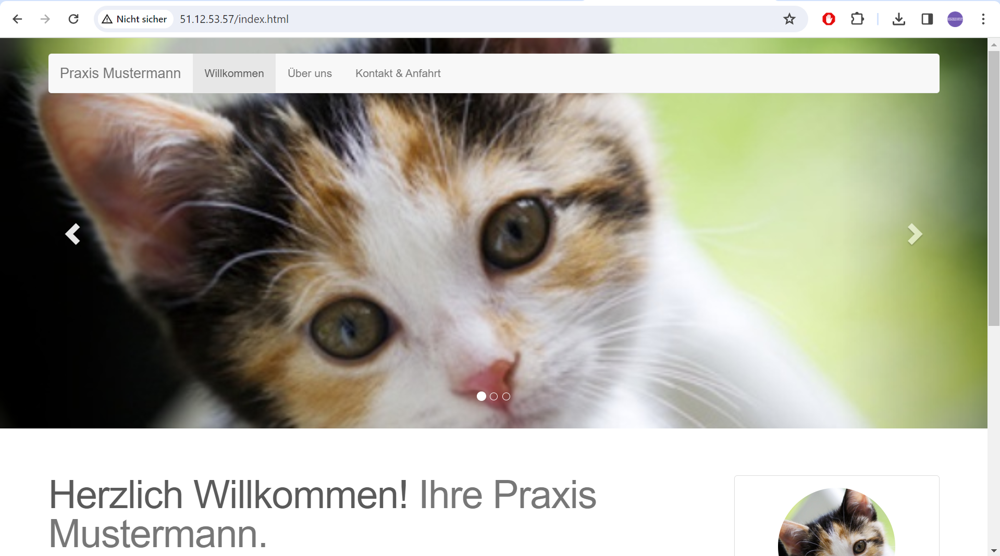

# Laborübung 3 - HTTP (GNS3)

 - Datum: 15.12.2023
 - Name: Lukas Grüter
 - [Link zur Aufgabenstellung](https://gitlab.com/alptbz/m123/-/tree/main/07_HTTP/HTTP_Webserver?classId=9ba60267-a232-4ef1-8383-77bdea5d9bdf)

---

## Loginvorgang

## Services des Netzwerks

## Service hinzugefügt

## Titel der Website geändert

## Wireshark Test

## Erstellung einer eigenen Website

 - Download von WinSCP
	- Login auf dem Server via WinSCP (mit bekannten Credentials), so dass Files später hochgeladen werden können.
 - Berechtigungen für Upload von Files vergeben

 - Hochladen der Websiten-Files unter dem Pfad /var/www/html

 - Website überprüfen

