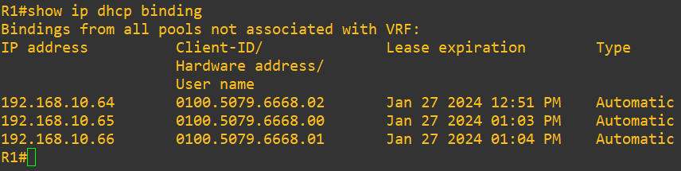
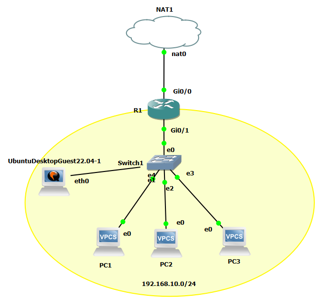

# Laborübung DHCP Advanced - Config aus Cisco Router lesen

 - Datum: 19.01.2024
 - Name: Lukas Grüter
 - [Link zur Aufgabenstellung](https://gitlab.com/alptbz/m123/-/blob/main/05_DHCP/DHCP_GNS3/01_DHCP%20Server%20Konfiguration%20Cisco.md?classId=9ba60267-a232-4ef1-8383-77bdea5d9bdf)

---

# Fragen 1 - IP Adressen

1. Welche IP-Adresse ist auf dem Interface GigabitEthernet0/0 und GigabitEthernet0/1 konfiguriert?
    - Für Interface 0/0: 192.168.122.90
    - Für Interface 0/1: 192.168.10.1
2. Ist das Interface GigabitEthernet0/2 aktiv? Welchen Status hat es?
    - Nein, das Interface ist offline, der Status ist "administratively down".
3. Wo ist das Interface GigabitEthernet0/1 in der Netzwerkgrafik zu finden?
    - Es ist zwischen Router und Switch zu finden.

# Fragen 2 - Konfiguration

1. Mit welchem Befehl (wie lautet die Zeile) wurde der Name des Routers konfiguriert?
    - Mit "hostname R1" wurde der Name des Routers konfiguriert.
2. Wie lautet das Passwort für den remote access mit TELNET?
    - Das Passwort lautet "cisco".

# Key Value Liste

- network: 192.168.10.0 255.255.255.0
- ip address pool: 192.168.10.64 - 192.168.10.255
- default gateway: 192.168.10.1
- dns nameserver: 192.168.10.1
- interface: 0/1

1. Welche IP-Adresse wird dem ersten DHCP-Client vergeben, der einen DHCP request macht?
    - Dem Client wird die Adresse 192.168.10.64/24 vergeben, da immer die tiefste Adresse im DHCP-Pool zuerst vergeben wird.

# DHCP Lease

1. Welche IP Adresse wir dem Client zugeteilt?
    - 192.168.10.64/24
2. Nach welcher Zeit müssen die Clients den DHCP lease erneuern?
    - Nach einem Tag muss die IP neu geleast werden.
3. Welche Option Nummer hat die Option "Router"?
    - Der Router hat die Nummer 3.
4. Welche Option Nummer hat die Option "Domain Name Server"?
    - Der Domain Name Server hat die Nummer 6.

[DHCP-Log](DHCP-Log.pcap)

# VPCS

1. show ip
    - Dieser Befehl zeigt uns die aktuellen IP-Konfigurationen an. Also die eigene IP, Subnetzmaske, Gateway, DHCP, DNS, Lease-Time, MAC, usw. Er wird für die Überprüfung der Konfiguration verwendet.
2. dhcp
Führt einen neue DHCP-Suche nach DORA-Prinzip aus. So wird die IP neu geleast.
3. ping 192.168.10.1
    - Mit diesem Ping wird versucht den Router zu erreichen (Default Gateway.)
4. ping google.ch
Mit diesem Ping versuchen wir google.ch zu erreichen. So können z. Bsp. die DNS-Dienst überprüft werden, sofern ein Signal zurückkommt, ist dieser funktionsfähig. 
5. ping 8.8.8.8
    - Mit diesem Ping versuchen wir den DNS-Server von Google zu erreichen. Das ist ein bekannter Server, welche für viele DNS-Namensauflösungen gebraucht wird.

# PCs konfigurieren

Die PCs wurden mit "ip dhcp" und "save" auf eine standardmässige IP-Config mit DHCP gesetzt.

# DHCP - Bindings

# Ubuntu Desktop Guest

1. Können Sie mit dem Firefox der Ubuntu VM auf https://watson.ch zugreifen?

